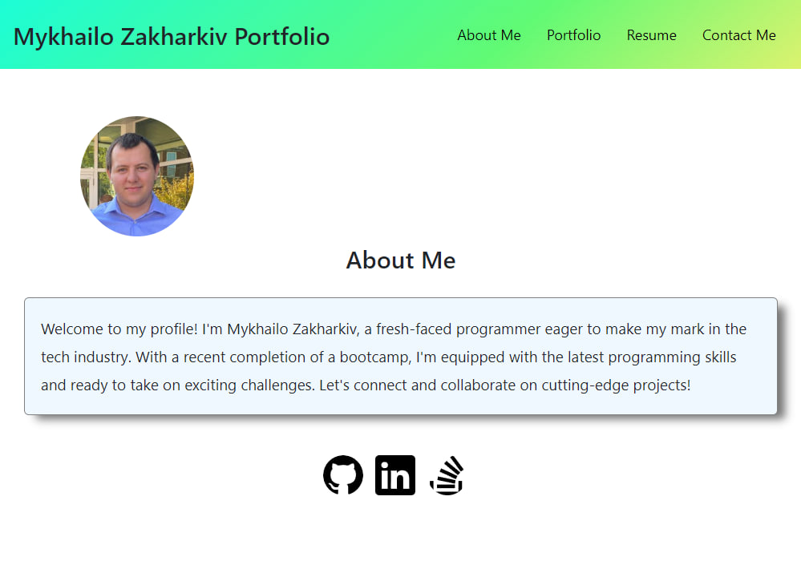
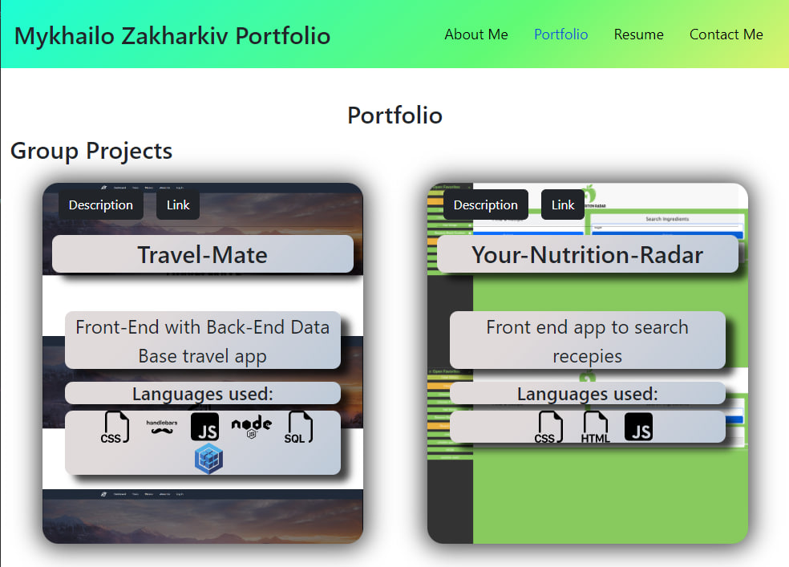
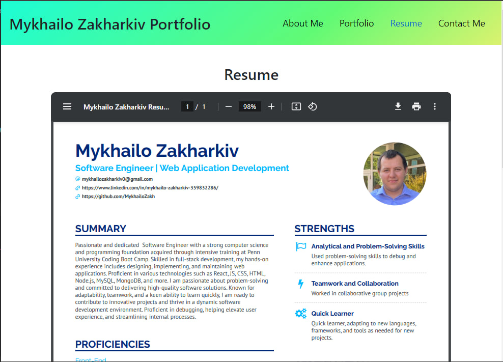
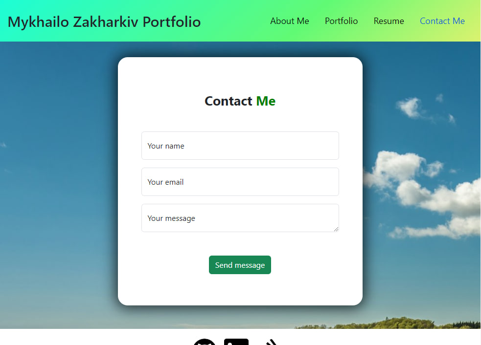

# React-Rendering-Portfolio

My portfolio web application

## Description

In this project I wanted to create React application that will render different pages in different routes. I added different rendering points like:

- NavBar and Footer that will folow user all the time with navigation buttons
- About me page that render info about me and my picture
- Portfolio page that render different groups of projects that I done in my journey
- Resume page that render pdf file of my resume in big screen and image of resume on small screens
- Contact me page that render contcat me form and check input conditions
- Error page if user hit wrong route

## Table of Contets

- [Screenshots](#screenshots)
- [Links](#links)

## Screenshots

In this section I provided screenshots of live web application

## Links

In this section I added links to the Live Application and to the GitHub repository of the original code base.

Live App:
https://main--teal-queijadas-e3878a.netlify.app/

GitHub Code Repository:
https://github.com/MykhailoZakh/React-Rendering-Portfolio
